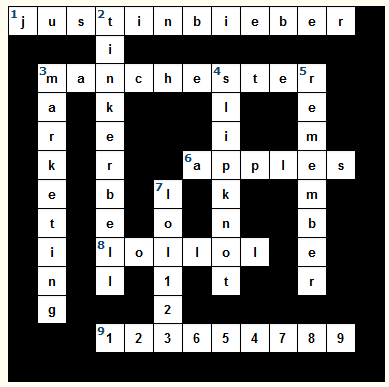

# Crypto course, week 3

## Task 1
### Task 1.1

2*128 bit message and random 128 bit key are defined. Same message is encrypted with same key using AES with three different modes of operation
```python
from Crypto.Cipher import AES
from Crypto.Random import get_random_bytes

data = b'12345678901234561234567890123456' 
key = get_random_bytes(16) 

aesecb = AES.new(key, AES.MODE_ECB) 
aescbc = AES.new(key, AES.MODE_CBC)
aesctr = AES.new(key, AES.MODE_CTR)

ecbText = aesecb.encrypt(data)
cbcText = aescbc.encrypt(data)
ctrText = aesctr.encrypt(data)
```
Ciphertexts are printed:
```python
print(binascii.hexlify(ecbText) ) # b'8cf3a39aba3c4734ab916fcf55e34ccc8cf3a39aba3c4734ab916fcf55e34ccc'
print(binascii.hexlify(cbcText) ) # b'f48335359a32caa8a61b2883bca3b1db1b774557e5892bd4a302b20f3e95cb9c'
print(binascii.hexlify(ctrText) ) # b'a0f4d0a940003ca249a62b75659538d7335b05a34e38ee1f25b9b7ba7e2bc817'
```
With the blocks separated:
```terminal
b'8cf3a39aba3c4734ab916fcf55e34ccc  8cf3a39aba3c4734ab916fcf55e34ccc'
b'f48335359a32caa8a61b2883bca3b1db  1b774557e5892bd4a302b20f3e95cb9c'
b'a0f4d0a940003ca249a62b75659538d7  335b05a34e38ee1f25b9b7ba7e2bc817'
```
 With ECB both blocks are identical.

 Let's  add three characters to message so it's 2 blocks plus 3 bytes long:
 ```python
data = b'12345678901234561234567890123456jee'
ctrText = aesctr.encrypt(data)
print(binascii.hexlify(ctrText) ) # b'7fbf15e4717b55a80a02478c0fd4b2d7 66dbfd621b390419fa25b16742a89303 c56fe8'
```
With CTR mode the ciphertext is same length as the message. We can also see that the whole ciphertext completely changes even if the message is mostly same.

## Task 1.2. 
CBC and CTR achieve indistinguishability by using unique iv/nonce. ECB does not have any measures for this.

## Task 1.3.
ECB and CBC require padding to work, so they will be longer than the plaintext unless plaintext%blocksize == 0<br><br>

# Task 2: Wrong model type of attack
Following articles were used for understanding the attack:

https://arstechnica.com/information-technology/2013/11/how-an-epic-blunder-by-adobe-could-strengthen-hand-of-password-crackers/ 

https://nakedsecurity.sophos.com/2013/11/04/anatomy-of-a-password-disaster-adobes-giant-sized-cryptographic-blunder/
## Task 2.1. 


## Task 2.2.
Passwords are protected by encrypting them with triple DES on ECB mode. Same key is used for all of them. Password hints are stored as plaintext.

## Task 2.3. 
Passwords are hashed and only hashes are stored in database. Random salt is used for every password. This way same passwords is not always hashed to same value

## Task 2.4.
Same key was used for all the passwords so same passwords were encrypted to same ciphertext. Because of this, all hints(which were not encrypted) corresponding to same password can be bundled. Some Password lengths could be found out because Same blocks always result in same cipher block in ECB.(For example NULL + seven padding bytes would always encrypt to same last block.)

## Task 2.5.
Pretty much any other mode would have revealed less about the passwords. One of the biggest problems was that all the same passwords were encrypted to same ciphertext. Some kind of iv would have helped with this. Some of the modes would also have revealed less abou the length of password. However, hints were not encrypted so encryption mode would have not helped with that<br><br>

# Task 3: Forged cipher
### Task 3.1.
If ciphertext and plaintext are known we can find out the stream used for encryption/decryption with xor operation. 
```python
import hashlib

cipherText=0xa7896ad1b2f7da8d40b33d1438e04a839a88b5c9a97625fe5017a5e1fb542072595d804d5ad1a3af11ea7244a39d76cde1
plainText = int.from_bytes('Move the tables to the patio as soon as possible!'.encode('ascii'), 'big')
stream = cipherText^plainText

newPlain = int.from_bytes('Move the chairs to the house as soon as possible!'.encode('ascii'), 'big')
newCipher = stream^newPlain

print(hex(newCipher))
```

New ciphertext:
```terminal
0xa7896ad1b2f7da8d40a434173df74a839a88b5c9a97625e65e16bfebfb542072595d804d5ad1a3af11ea7244a39d76cde1
```

Hash:
```terminal
$ echo -n a7896ad1b2f7da8d40a434173df74a839a88b5c9a97625e65e16bfebfb542072595d804d5ad1a3af11ea7244a39d76cde1 | openssl dgst -sha256
(stdin)= 102f853f3e0f38fa7ba7448e6933acaaec5c1bd975c93fc65bff4faa94d2ca34
```

### Task 3.2. 
CTR mode changes block cipher to stream cipher.
### Task 3.3.
Length of the ciphertext needs to be same as original.<br><br>

## Task 4: Padding oracle
Attack could be avoided by using different mode of encryption. Biggest flaw, however was the padding oracle that gives out too much information. Validation should be done in such a way that it can't be found out if padding is incorrect. In this case oracle informs us if padding is correct without checking if text can actually be decrypted. 

isValid method is for checking with the decryptor if given data has correct padding:
```python
def isValid(dada):
    with open("newfile", "wb") as file:
        file.write(dada)
        file.close()
        result = subprocess.run(["./decryptor" ,"-f", "newfile"], capture_output=True)
        if(result.returncode == 0):
            return True     
        else:    
            return False
```
shiftUp method is for changing the block so that it decrypts to different padding. For example if block end would have before decrypted to 02 02, now it is decrypted to 03 03.  
```python
def shiftUp(block, n):
    pads = bytearray()
    for x in range(n):
        newByte = block[(-1-x)]^n^(n+1) 
        pads.insert(0, newByte )  
        newBlock = block[:16-n] + pads  
    return newBlock
```
To solve a single block we need also preceding block block1. Attack is started from the last byte of the block2. With the help of oracle we find the byte in the end of block1 that would lead to 01 in the end of block2. As encryption and decryption are done with xor operation we can now calculate the plaintext byte that would encrypt to corresponding ciphertext byte. 

After that we shiftUp last byte of block1 to byte that would lead to 02 in plaintext and use oracle to find next to last byte that fits. Rinse and repeat.
```python
def solveBlock(block1, block2):
    plain = ''
    for n in range(1,17):
        for x in range(256):
            testByte = x.to_bytes(1, 'little')
            testData = block1[:16-n] + testByte + block1[17-n:] + block2  
            if( isValid(testData) ):
                plain += chr( n^x^block1[-n] )
                block1 = testData[:16]
                block1 = shiftUp(block1, n)           
            else:    
                pass
    return plain[::-1]
```
With the help from previous methods data from the file is iterated block by block.
```python
with open("ciphertext", "rb") as file:
    data = file.read()
file.close() 

plainText=''
for x in range(0, 96, 16):
    block1 = data[x:x+16]
    block2 = data[x+16:x+32]
    plainText += solveBlock(block1, block2)
    
print(repr(plainText))
```
Tadaa! Don't know and don't care enough to find out if last two bytes are part of message or resulted from 02 02 padding. 
```terminal
'Did you know, that encryption algorithm does not matter in padding oracle attack\x0c\x0f'
```