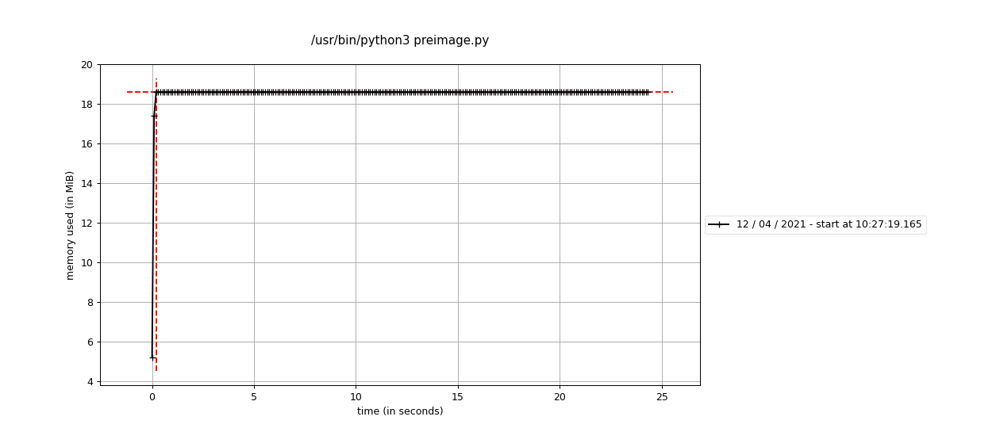

# week 4 Answers

## Task 1

### Task 1.1

Salsa20 is used for encryption. Two ciphers are defined with same key and same nonce so we get identical keystreams when encrypting. 
```python
secret = b'*Thirty-two byte (256 bits) key*'
ntwice = b'12345678'
cipher1 = Salsa20.new(key=secret,nonce=ntwice)
cipher2 = Salsa20.new(key=secret,nonce=ntwice)
msg = cipher1.encrypt(b'Move the tables to the patio as soon as possible!')
msg2 = cipher2.encrypt(b'Move the chairs to the house as soon as possible!')
print(msg.hex())
print(msg2.hex())
```

Results are pretty similar as keystreams are same and bitwise xor is used. Effectively this means that same character in same position always results to same ciphertext character.
```console
cb6eefbf1bd532bbe4068ff8aeb92322e56fd00e9f15a68f3a624b45e6c85abb145c775bb9738e15a3aa3a0512a2fac060
cb6eefbf1bd532bbe41186fbabae2322e56fd00e9f15a6973463514fe6c85abb145c775bb9738e15a3aa3a0512a2fac060
```

### Task 1.2
```python
secret1 = b'123456789x123456789y123456789z11'
secret2 = b'123456789x123456789y123456789z12'
ntwice = b'12345678'
cipher1 = Salsa20.new(key=secret1,nonce=ntwice)
cipher2 = Salsa20.new(key=secret2,nonce=ntwice)
msg =  cipher1.encrypt(b'Alabamamamabamaalaa')
msg2 = cipher2.encrypt(b'Alabamamamabamaalab')
print(msg.hex())
print(msg2.hex())
```
Even with really similar keys the ciphertexts seem completely different. I guess salsas 20 rounds are enough to make even small changes matter.
```console
f7cec07210e4683457a307b64f5ab7233a9985
7d21ece9eadda4129718e704e1dfc492287303
```
### Task 1.3
Large chunk of random data is defined to start seeing some differences. 
```python
data = get_random_bytes(2**27)
secret = b'*Thirty-two byte (256 bits) key*'

aescbc = AES.new(secret, AES.MODE_CBC)
aesctr = AES.new(secret, AES.MODE_CTR)
salsa = Salsa20.new(key=secret1)
```

time is taken and printed in milliseconds
```python
start = time.time()
cbcText = aescbc.encrypt(data)
end = time.time()
print(1000*(end-start))

start = time.time()
ctrText = aesctr.encrypt(data)
end = time.time()
print(1000*(end-start))

start = time.time()
salsaText = salsa.encrypt(data)
end = time.time()
print(1000*(end-start))
```
results:
```console
614.0978336334229
399.137020111084
842.1108722686768
```
## Task 2

### Task 2.1
Heres the search for partial collision for three first bytes. key1 is a message we are trying to find collision for. key 2 is a random 5 byte message that we keep changing until collision is found. Elapsed time is printed in seconds and after that the two colliding messages in hexadecimal.
```python
key1 = b'\x00\x00\x00\x00\x00'
h1 = hashlib.md5(key1).digest()
key2 = get_random_bytes(5)
h2 = hashlib.md5(key2).digest()

start = time.time()

while h1[:3] != h2[:3]:
    key2 = get_random_bytes(5)
    h2 = hashlib.md5(key2).digest()

end = time.time()
print(end-start)
print(key1.hex() +'\n'+ key2.hex() +'\n')
```
Exactly same thing is done with sha1 and sha256. Code differs only in constructors which are (in order): md5(), sha1() and sha256().

Output: 
```console
9.81313180923462
0000000000
ed5835f67c

44.60183835029602
0000000000
7a7f4434f8

60.68606972694397
0000000000
127ea216e9
```
In this single example it seems that md5 was fastest and sha256 was slowest.

### Task 2.2
Here's my supersimple preimage search. We start with a random message which is hashed and checked if it has 3 zeros in the beginning. After that the hash is hashed and checked if it has 3 zeros in the beginning and after that the hash of a hash of a hash is hashed... Problem of course is that it could get stuck in a loop before preimage is found. Seem's to be fine though if we are only trying to find 3 starting bytes.

Elapsed time is printed in seconds and after that the preimage is printed
```python
h = get_random_bytes(5)
nexth = hashlib.md5(h).digest()

start = time.time()

while nexth[:3] != b'\x00\x00\x00':
    h = nexth
    nexth = hashlib.md5(h).digest()

end = time.time()
print(end-start)
print(h.hex() +'\n')
```
Exactly same thing is done with sha1 and sha256. Code differs only in constructors which are (in order): md5(), sha1() and sha256().

Output: 
```console
6.1517298221588135
c179a45a4f5c21ef2b6f1daeec03ca05

14.093557119369507
4d0d71de31c44d4574f2249a22738858c11ebf66

3.931833267211914
ffb80c6e656104a50c4fcea269775a5fe235b741a04328eb8a29c00ed8179773
```

### Task 2.3
memory_profiler reported memory usage for preimage search:

For the hash collision memory usage was pretty similar (around 19MiB)

Run both 10 times and calculate execution time
```terminal
time for i in {1..10}; do python3 preimage.py;  done
real	6m7.445s

time for i in {1..10}; do python3 hashcollision.py;  done
real	19m11.294s
```
## Task 3
If the key and nonce are the same for all the messages we know that the keystream will also be the same. That in turn means that every 50th plaintext byte is xored with same keystream byte to produce the ciphertext byte in that position.

solveX method takes list of ciphertext bytes that are encoded with the same keystream byte. Then we produce every possible xor combination with our alphabet bytes(lovercase ascii and empty space) to get possible keystream bytes. Most frequent byte is returned (byte that xorred with cipherbyte always results to alphabet byte). Not a perfect solution but should be enough.
```python
def solveX(crap):
    alphabet = bytes('qwertyuiopasdfghjklzxcvbnm ', 'ascii')
    possiblevalue = []
    for x in alphabet:
        for y in crap:
            possiblevalue.append(y^x)
    return mode(possiblevalue)
```

Lets start by reading the file and converting to lists of bytesized hex numbers. 
```python
with open("task3_messages.txt", "r") as file:
    lines = file.read().splitlines()
file.close() 

cipherInts = []
for x in range(10):
    cipherInts.append( list(binascii.unhexlify(lines[x])))
```
And then put all the bytes in their own baskets. Every 50th byte in same basket.
```python
baskets = []
for n in range (50):
    singleBasket = []
    for intList in cipherInts:
        singleBasket.append( intList[n] )
    baskets.append(singleBasket)
```
Then pass the baskets to solver one by one. stream should now hold the keystream. So let's xor keystream with ciphertext to get the plaintext. Then convert to ascii and print.
```python
stream = []
for x in range (50):
    stream.append( solveX(baskets[x]) )

plain = []
for cipherLine in cipherInts:
    for n in range (50):
        plain.append( stream[n]^cipherLine[n] )

plainAscii = ''.join(chr(i) for i in plain)
print (plainAscii)
```
Not quite there
```terminal
it was a bright bole day in xpril and vhu elocks qere striking thistedn winstow smith hiq shon nuzzjed into his breart hn an effvrt to esccpu rhe vilc wind slipped quhckmy througq the glasq toirs of pictory mansions uhotgh not qlickly enowgx ro prevcnt a swirl of grhttx dust frvm enterine qling witn himthe hallway rmemt of boiued cabbagg qnb old rgg mats at one ene og it a cououred posveb roo larae for indoor disqlax had beew tacked tm dhc wall ot depicted simplx ao enormouj face morg dhgn a mer
```
However it's close enough to start guessing the right characters. Let's xor guesses with ciphertext bytes to get keystream bytes and then update keystream 
```python
stream[16] = cipherInts[0][16]^ord('c')
stream[19] = cipherInts[0][19]^ord('d')
stream[28] = cipherInts[0][28]^ord('a')
stream[38] = cipherInts[0][38]^ord('t')
stream[40] = cipherInts[0][40]^ord('e')
stream[42] = cipherInts[0][42]^ord('c')
stream[49] = cipherInts[0][49]^ord('w')
```
Again xor keystream with ciphertext, convert to ascii, print
```terminal
it was a bright cold day in april and the clocks were striking thirteen winston smith his chin nuzzled into his breast in an effort to escape the vile wind slipped quickly through the glass doors of victory mansions though not quickly enough to prevent a swirl of gritty dust from entering along with himthe hallway smelt of boiled cabbage and old rag mats at one end of it a coloured poster too large for indoor display had been tacked to the wall it depicted simply an enormous face more than a met
```
## Task 4

Still working on this 

get guestuser auth cookie 

Pad and append (don't know yet with what)

calculate new signature with hashpump

```python
authvalue = "dXNlcm5hbWU9Y3J5cHRvbmF0b3I7c2VjcmV0PTQwN2M2OTFmNzlkMDk2NDEyYmFlMmIxMzNlMmQwNTM0MTQxNjcwNDJiNTU5MjhmMzRhMmMxNWM4NDIxMGQyOTc7.Y9y8HZbFbOLkcLU+wDNPMvCCv+Yvp+cvzXd9pLsubtg="
b64_data, b64_sig = authvalue.split('.')
data =b64decode( b64_data )
sig = b64decode( b64_sig )
print( data)
print(sig.hex())
#b'username=cryptonator;secret=407c691f79d096412bae2b133e2d053414167042b55928f34a2c15c84210d297;'
#63dcbc1d96c56ce2e470b53ec0334f32f082bfe62fa7e72fcd777da4bb2e6ed8
```
```terminal
hashpump -s '63dcbc1d96c56ce2e470b53ec0334f32f082bfe62fa7e72fcd777da4bb2e6ed8' --data 'username=cryptonator;secret=407c691f79d096412bae2b133e2d053414167042b55928f34a2c15c84210d297;' -a '?????' -k 10-19
```
try all possible keylengths 10-19?

EDIT 16.5

Didn't get it right before deadline but solved it now.

Find out what the guestuser auth cookie has eaten:
```python
s = requests.Session()
s.post('http://0.0.0.0:5000/login', data = {'username':'cryptonator','password':'cryptonator'})

cookie = s.cookies['auth']
b64_data, b64_sig = cookie.split('.')
data = b64decode(b64_data)
sig = b64decode(b64_sig)

print(data.decode())
print( sig.hex() )
```

Feed it to the hashpump with our addition('admin' and admin secret). Try with different keysizes (Got lucky with 12)
```terminal
hashpump -s '4fa8116f332bf42eeef92f2ceeb18ebf5689ebd1e6094fb0612d0d742eadd7f3' --data 'username=cryptonator;secret=407c691f79d096412bae2b133e2d053414167042b55928f34a2c15c84210d297;' -a ';username=admin;secret=6b337775fce2301772f36e05a10ed9822033a7496520cf24ebe13ed324262c99;' -k 12
a80a460353ed983ff879526b2587f35e3762769e7381129096519a9b3ed5b7be
username=cryptonator;secret=407c691f79d096412bae2b133e2d053414167042b55928f34a2c15c84210d297;\x80\x00\x00\x00\x00\x00\x00\x00\x00\x00\x00\x00\x00\x00\x00\x00\x00\x00\x00\x00\x00\x03H;username=admin;secret=6b337775fce2301772f36e05a10ed9822033a7496520cf24ebe13ed324262c99
```
Encode the data and create new auth cookie:
```python
newdata = b'username=cryptonator;secret=407c691f79d096412bae2b133e2d053414167042b55928f34a2c15c84210d297;\x80\x00\x00\x00\x00\x00\x00\x00\x00\x00\x00\x00\x00\x00\x00\x00\x00\x00\x00\x00\x00\x03H;username=admin;secret=6b337775fce2301772f36e05a10ed9822033a7496520cf24ebe13ed324262c99;'
newsig = bytes.fromhex('a80a460353ed983ff879526b2587f35e3762769e7381129096519a9b3ed5b7be')
b64sig = b64encode(newsig).decode()
b64data = b64encode(newdata).decode()

newAuth = b64data +'.'+ b64sig
cookies = dict(auth = newAuth)

s2  = requests.Session()
r = s2.get('http://0.0.0.0:5000/admin/top-secret', cookies = cookies)
print(r.text)
```
Cookie is passed and response printed:
```terminal
"Every secret creates a potential failure point." — Bruce Schneier
```