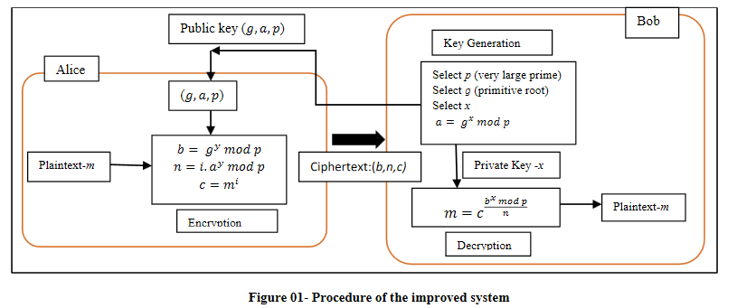

# Cryptoexercises, week 7
## Task 1
### Task 1.1

g and p are hardcoded to SingleParty class. p_modulus is safe prime from rfc3526 and 2 is generator for the group 
```python
class SingleParty:

    g: int = 2

    p_modulus: int = 0xFFFFFFFFFFFFFFFFC90FDAA22168C234C4C6628B80DC1CD129024E088A67CC74020BBEA63B139B22514A08798E3404DDEF9519B3CD3A431B302B0A6DF25F14374FE1356D6D51C245E485B576625E7EC6F44C42E9A637ED6B0BFF5CB6F406B7EDEE386BFB5A899FA5AE9F24117C4B1FE649286651ECE45B3DC2007CB8A163BF0598DA48361C55D39A69163FA8FD24CF5F83655D23DCA3AD961C62F356208552BB9ED529077096966D670C354E4ABC9804F1746C08CA18217C32905E462E36CE3BE39E772C180E86039B2783A2EC07A28FB5C55DF06F4C52C9DE2BCBF6955817183995497CEA956AE515D2261898FA051015728E5A8AACAA68FFFFFFFFFFFFFFFF  

```
Alice class. Secret exponent is a random 256 bit long safe prime. Not sure why it needs to be safe prime. Setters calculate needed exponentiations. Bob class is very similar 
```python
class Alice(SingleParty):

    _P: int = getSafePrime(256)  # Private exponent
    A: int = 0

    def __init__(self):
        super(SingleParty).__init__()  

    def set_A(self):
        Alice.A = pow(Alice.g, Alice._P, Alice.p_modulus)
        pass

    def set_G(self, B: int):
        Alice._G = pow(B,Alice._P,Alice.p_modulus)   
        pass
```
Method for getting safe primes. Could have used existing(faster) solutions but didn't realize it then
```python
def getSafePrime(length):

    p = getPrime(length)
    
    while not isPrime((p-1)//2):
        p = getPrime(length)
    return p
```
Eve class. Private exponents are picked randomly same as Alice and Bob. Public values are calculated in the constructor. set_g is for changing between shared keys.
```python
class Eve(SingleParty):

    A: int = 0  # A from Alice
    C: int = 0  # C for Bob
    B: int = 0  # B from Bob
    D: int = 0  # D for Alice
    _P1: int = getSafePrime(256)  # Private exponent for Alice
    _P2: int = getSafePrime(256)  # Private exponent for Bob
    _G1: int = 0  # Shared key with Alice
    _G2: int = 0  # Shared key with Bob

    def __init__(self):
        super(SingleParty).__init__()
        Eve.C = pow(Eve.g, Eve._P2, Eve.p_modulus)
        Eve.D = pow(Eve.g, Eve._P1, Eve.p_modulus)
    
    def set_G1(self, A: int):
        Eve._G1 = pow(A,Eve._P1,Eve.p_modulus)
        pass

    def set_G2(self, B: int):
        Eve._G2 = pow(B,Eve._P2,Eve.p_modulus)
        pass

    def set_G(self, party):
        if party == "Alice":
            Eve._G = Eve._G1
        if party == "Bob":
            Eve._G = Eve._G2
        pass
```
Here's the workflow for establishing keys with Alice and Bob
```python
al = Alice() #Alice wakes up and her private exponent is defined
al.set_A() #Alice's public value is calculated

ev = Eve() #Eve's private exponents and public values are initialized at this point
ev.set_G1(Alice.A) # Secret with Alice is calculated

bo = Bob() #Bob wakes up and his private exponent is defined
bo.set_B() #Bob's public value is calculated

bo.set_G(Eve.C) # Eve gives her public value to Bob and Bob calculates the secret 
ev.set_G2(Bob.B) # Secret with Bob is calculated

al.set_G(Eve.D) # Eve gives her public value to Alice and Alice calculates the secret
```
Finally the decryption and re-encryption of data by the middleman is demonstrated 
```python
cipherA = al.encrypt("Hello") # Alice encrypts a message

ev.set_G("Alice") # G is set to the secret established with Alice
plain = ev.decrypt(cipherA) # Eve decrypts with the common secret with Alice 
print(plain)
ev.set_G("Bob") # Eve switches to Bob-mode
cipherB = ev.encrypt(plain) # Eve encrypts with the Bob-secret 

plain = bo.decrypt(cipherB) # Bob decrypts
print(plain)
```

### Task 1.2
Some g values can lead to shared secrets g^ab to be from small subset instead of whole Zp*. This being the case eavesdropper is able to form private exponent which combined with victims public key will reveal information on the victims private exponent. To address this issue p should be safe prime so Zp* won't contain small subgroups.

### Task 1.3
Authentication is added so parties know if they can trust the messages they are receiving and reject messages from middleman.


## Task 2

### Task 2.1
Search for Alice's sahre's order d:
```python
for d in range(1,715517):
    if pow(pub,d, p) == 1:
        break
print(d)
#101
```

### Task 2.2
Alices share generates subgroup with order of 101. So it reduces shared secret to one of the subgroup elements.

If I choose such an exponent that my share also generates a subgroup then the secret would be an element that is found from both of the subgroups.
### Task 2.3
Here's the factoring. First find some small primes. Then start factoring and collecting divisors to a list
```python
primes = []
for y in range(2,1000):  
    if isPrime(y):
       primes.append(y)

p1 = p-1
divisors = []

while p1 > 1:
    for x in primes:
        while p1%x == 0:
            divisors.append(x)
            p1=p1//x
    
print(Counter(divisors))
```
Factors printed. p-1 = 2^421 * 3^210 * 5^105 *....* 421
```console
Counter({2: 421, 3: 210, 5: 105, 7: 70, 11: 41, 13: 34, 17: 26, 19: 23, 23: 18, 29: 14, 31: 13, 37: 11, 41: 10, 43: 9, 47: 9, 53: 8, 59: 7, 61: 7, 67: 6, 71: 6, 73: 5, 79: 5, 83: 5, 89: 4, 97: 4, 101: 4, 103: 4, 107: 3, 109: 3, 113: 3, 127: 3, 131: 3, 137: 3, 139: 3, 149: 2, 151: 2, 157: 2, 163: 2, 167: 2, 173: 2, 179: 2, 181: 2, 191: 2, 193: 2, 197: 2, 199: 2, 211: 2, 223: 1, 227: 1, 229: 1, 233: 1, 239: 1, 241: 1, 251: 1, 257: 1, 263: 1, 269: 1, 271: 1, 277: 1, 281: 1, 283: 1, 293: 1, 307: 1, 311: 1, 313: 1, 317: 1, 331: 1, 337: 1, 347: 1, 349: 1, 353: 1, 359: 1, 367: 1, 373: 1, 379: 1, 383: 1, 389: 1, 397: 1, 401: 1, 409: 1, 419: 1, 421: 1})
```
From the fundamental theorem of cyclic groups we know that order of the subgroup with generator g^k is p-1/gcd(k,p-1) where k is a divisor of p-1. 

So we could for example find small subgroup by choosing such a k that it's greatest common divisor with p-1 is very big. For example choosing k = (p-1)/2 would result to a subgroup of order 2 and k = p-1 would result to a subgroup with order of 1. choosing k = (p-1)/d would result to a subgroup of order d for all the divisors d of p-1.

### Task 2.4
According to NIST guidelines you would achieve 128 bit security strength when using 3072 bit long modulus. So 3121 bits would produce at least 128 bit security level. Course book mentions somewhat lower estimates for security strengths than current guidelines. Not sure why


## Task 3 
### Task 3.1
c2 (second value on the ciphertext) can be simply multiplied to produce multiple of original plaintext when decrypted. Furthermore, simple multiplication can be used to produce new ciphertexts. These are demonstrated in the last task. 
### Task 3.2
Cramer–Shoup cryptosystem has been proposed to combat malleability of elGamal. Cramer–Shoup has some extra parameters and hash of message and public values is used and decryption is not done if not matching.
Cramer, R., & Shoup, V. (1998, August). A practical public key cryptosystem provably secure against adaptive chosen ciphertext attack.

Wikipedia article mentions padding schemes as a solution for elGamla malleability

Dissanayake(2018) proposes following improvements to elGalam:
Message is written as a factor of i prime numbers  m=   p1p2p3...pi, 
Shared secret is multiplied by i
Three values are sent: (g^y, m^i, ig^xy)
Shared secret is calculated as before, and with that i can be found out.
Message can be found by finding inverse of i


Dissanayake, W.D.M.G.M.. (2018). An Improvement of the Basic El-Gamal Public Key Cryptosystem. International Journal of Computer Applications Technology and Research. 7. 40-44. 

### Task 3.3
Given parameters are hardcoded to g, puby and p. Ciphertext lines are in l1 to l8.
```python
g = 71077...
puby = 42524...
p = 95355...

l1 = (245...835, 695...634)
l2 = (603...642, 587...760)
l3 = (932...
.
.
.
l8 = (262...044, 171...716)

```
New values are created. In first ones the c2 value is simply multiplied mod p. To inverse multiplication by 4 we multiply by inverse of 4 mod p.
```python
new1 = ( l1[0],  6*l1[1]%p             )
new2 = ( l2[0],  l2[1]                 )  
new3 = ( l3[0],  2*l3[1]%p             )
new4 = ( l4[0],  pow(4, -1, p)*l4[1]%p )
new5 = ( l5[0],  l5[1]                 )
```
For the rest we also need to modify c1. Simply calculate product of given lines.
```python
new6 = ( new1[0]*new4[0]%p,          new1[1]*new4[1]%p          )
new7 = ( new2[0]*new3[0]*new5[0]%p,  new2[1]*new3[1]*new5[1]%p  )
new8 = ( new4[0]*new7[0]%p,          new4[1]*new7[1]%p          )
```
Format and write to file. [new_encryption.txt](new_encryption.txt)
```python
def stringify(line):
    return '('+ str( line[0] ) +', '+ str(line[1]) + ')\n'

lines =[stringify(new1),
        stringify(new2),
        stringify(new3),
        stringify(new4),
        stringify(new5),
        stringify(new6),
        stringify(new7),
        stringify(new8)]

f = open("Week7/new_encryption.txt", "w")
f.write('\n'.join(lines)+'\n')
f.close()
```
Let's check if hashes match. First for the whole file and then the individual lines.
```python
f = open("Week7/new_encryption.txt", 'rb')
print(sha256(f.read()).hexdigest())

f = open("Week7/new_encryption.txt", 'rb')
newlines = f.read().splitlines()
for l in newlines:
    print(sha256(l).hexdigest())
```
All the lines match but file doesn't. Formatting for the file should be exactly as it is in the ciphertexts.txt: newline after each valuepair. 
```console
b7a6c28da49fbb0440938640e8018ca3711f623a62430ac181fbcf05e1cc52bc
a7cdc13365995d2ddf54257f05181645c4d2f653fad7a576e66cd8bfbaab58ac
8c1f5c2ca2369615fbbb9ac00cf80d639e2edc2ddb80de5b3109d65ad3077857
31c33e8dfd13a8e366b69f78a05daf6a0e1999892af48024d64fd3efde27610c
49ca21a49bc16e5037237290697596dd5c5771015cad7b1b23533c8d24aa224d
7e1e23128c6b5b1d752cbb238c6ed2d1419cb86d11ec30e7cef2343274e8c024
d38709b91f082df723fa7cdc7d9d3c3af87e3c25ff6d1fc8eceb53a0973fa787
004082789d9fb77dffa3670eabad12eb472333545a64ea2fc8c77b3edb8f9dd4
efc5bb5c7dc5174734e253cafa50dd475c658d3d9330c6eaf6500bc13bc6edec
```