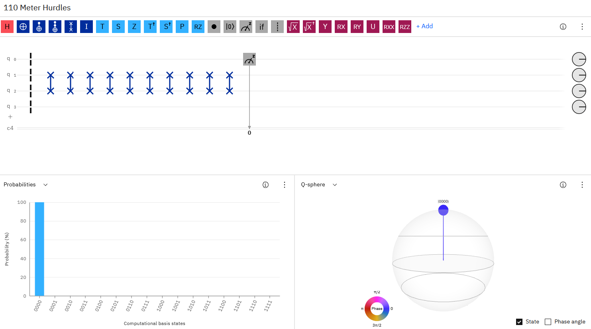
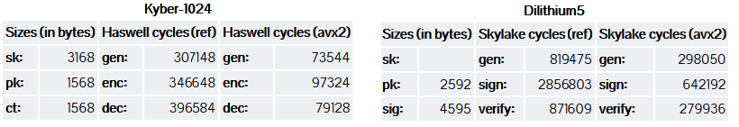
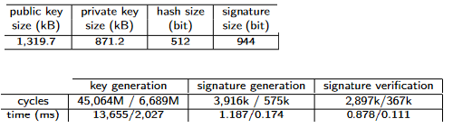

# Answers for Crypto course, week 9 Ville Karvonen 1961643

## Task 1
I didn't see any lectures so can't comment on those. Might have watched some if there were recordings.

It was fun to do some problem solving and coding in excercises. Some of the harder ones were fun. Overall, I'd say excercises were organized really well and they gave a good challenge. Really engaging and motivating. Some questions were confusing and made tasks unneccessarily time consuming because I didn't know what you meant. Here's some examples I still can remember:

Week 8 Task 4 was pretty annoying. Proxy was not working even with all port-forwarding and routing and correct primary group. I did double check and boot and reset and reconfigure and so on. Some wordings were also confusing. For example: "Your main goal is to identify supported TLS versions and ciphers from data analysis". What do you mean by data analysis? Should I implement it in the proxy or not? Why should I identify all supported ciphers? 

Week 7 task 2.2 was also weird: "How many possibilities there are for your common shared secret with the given Alice's share? Does this number depend on your choice of your secret exponent? Why or why not?". Of course it depends on my choice. If I too have chosen my secret then there is exactly one possibility for shared secret.

Week 7 task 1 file [diffie-hellman.py](https://github.com/ouspg/CryptoCourse/blob/00847a84dfb8efc3f4d2a66471afe9fe690d333a/Week7Exercises/diffie_hellman.py) says: "Select a prime p where (p – 1) / 2 is also prime and that p is large enough". It is confusing if this means  _P: private exponent or p_modulus. I would assume modulus but positioning of the comment and other comments made me think otherwise. Some nights I still find myself thinking if it matters for private exponent to be safe prime or not.

I don't have much complaints beyond small issues in wordings and some implementations. I'm sure you can fix them for next year and have even more awesome course!

## Task 2
### Task 2.1

First there is barrier. I guess it does nothing in practice. Documentation states: "To make your quantum program more efficient, the compiler will try to combine gates. The barrier is an instruction to the compiler to prevent these combinations being made. Additionally, it is useful for visualizations."

Then qbits 1 and 2 are swapped ten times. In the end qbit 0 is measured.

Basicly this circuit does nothing.

### Task 2.2
10, 01 and 11 can be found by removing one or both of the Z-gates.

## Task 3
### Task 3.1
Crystals: learning-with-errors (LWE) problem over module lattices is used for Public keys(kyber) and lattice problems over module lattices for signatures (dilithium). Easily scaled for all security levels. Levels 1, 2 and 5 are implemented in the submission. Benchmarks for level 5 in picture:

Classic McEliece is based on decoding a general linear code, binary Goppa codes are used in implementation. Scalable, To achive security level 5, parameter set 6688128 is minimum with 1044992 bytes public key and 13892 bytes secret key. Ciphertext size is 240 bytes. Keygen median for this parameter set is 466738128 cycles, 145528 cycles for encoding and 315496 for decoding. 

NTRU is lattice based: Shortest vector problem. Highest parameter set that is defined in submission is ntruhps4096821. Security level for this parameter set is 5 on local model (and 3 on non-local). For this  set, public key would be 1230 bytes, secret key 1590 bytes and ciphertext 1230 bytes. Key generation takes 31835958 cycles, encoding 1856936 and decoding 4920436.

Saber is based on another lattice problem: module learning with rounding problem. At security level 5 we have FireSaber-KEM. Public key is 1312 bytes and private 3040. Ciphertext is 1472 bytes. Key generation takes 336 cycles, encryption 402 and decryption 422. 

Falcon is based on short integer solution problem (another lattice problem). At security level 5 public key size is 1793 bytes, signature 1280 and key generation takes 27,45 ms. Falvon can perform 2913 signs per second and 13650 verifys per second. 

Rainbow is based on solving a set of random multivariate quadratic system. Benchmarks in picture: 

### Task 3.2
https://github.com/PQClean/PQClean has clean implementations of all finalists. These can easily be integrated into different libraries. 

Open quantum safe has liboqs, which is a C library that supports all finalists. Liboqs builds on Linux, macOS, and Windows, supports x86 and ARM architectures, and the clang, gcc, and Microsoft compilers. 

Open quantum safe also involves prototype integrations of liboq for different protocols and applications, including TLS and OpenSSL.

Using liboqs seems to be the most effortless way if working with C. There's also wrappers for C++, Go, Java, .Net, Python and Rust.  

### Task 3.2
"saber post quantum cryptography" found 694 results from Scholar.

  Article  |   Attack   
--- | ---
D'Anvers, J., Guo, Q., Johansson, T., Nilsson, A., Vercauteren, F., & Verbauwhede, I. (2019). Decryption Failure Attacks on IND-CCA Secure Lattice-Based Schemes. Public Key Cryptography. | In this attack failure rate of Lattice-based scheme is increased to obtain information from failed decryptions.
Sim, B., Kwon, J., Lee, J., Kim, I., Lee, T., Han, J., Yoon, H., Cho, J., & Han, D. (2020). Single-Trace Attacks on Message Encoding in Lattice-Based KEMs. IEEE Access, 8, 183175-183191. | Single-trace side-channel attacks against lattice-based key encapsulation is presented. Message encoding is analyzed to obtain an ephemeral session key. 
Ngo, K., Dubrova, E., Guo, Q., & Johansson, T. (2021). A Side-Channel Attack on a Masked IND-CCA Secure Saber KEM. IACR Cryptol. ePrint Arch, 79, 2021. | "A side-channel attack on a masked implementation of Saber which recovers the session key and the long-term secret key using 16 traces for LightSaber"
Ravi, P., Sinha Roy, S., Chattopadhyay, A., & Bhasin, S. (2020). Generic Side-channel attacks on CCA-secure lattice-based PKE and KEMs. IACR Transactions on Cryptographic Hardware and Embedded Systems, 2020(3), 307-335. https://doi.org/10.13154/tches.v2020.i3.307-335 | Chosen ciphertext attack that utilizes information from electromagnetic side channel
Prasanna Ravi, ShivamBhasin, Sujoy Sinha Roy, and Anupam Chattopadhyay. Drop by drop you break the rock -exploiting generic vulnerabilities in lattice-based pke/kemsusing em-based physical attacks. Cryptology ePrintArchive, Report 2020/549, 2020. | Another EM -based attack. Uses vulnerability in the message decoding function of all lattice-based PKE/KEMs (of second round pqc standardisation finalists). 

